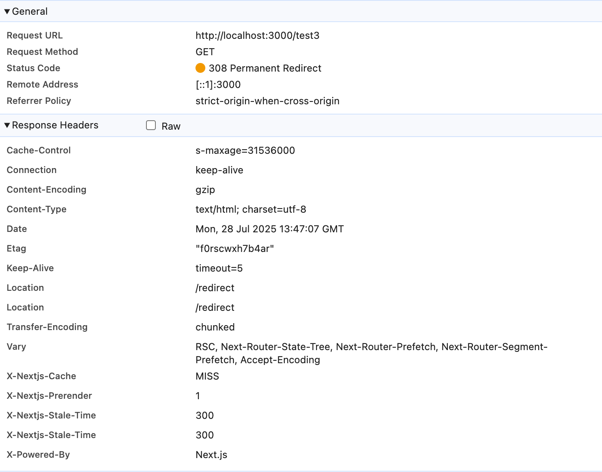

see: https://github.com/vercel/next.js/issues/82117

`npm run build && npm run start`

and go to `http://localhost:3000/test` or any other pathname with the network of the window console opened

You shall see:

